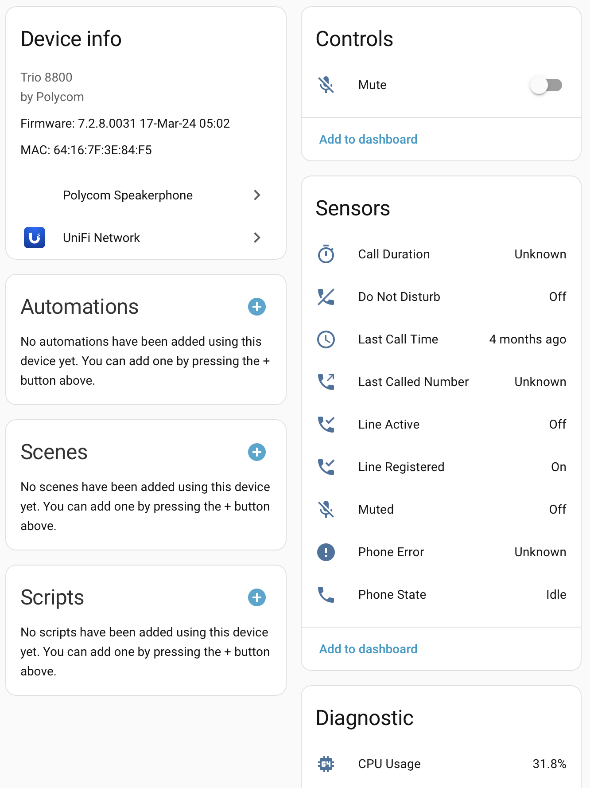

# Polycom Speakerphone Integration for Home Assistant

A custom Home Assistant integration for monitoring and [kind of] controlling Polycom Trio 8800 speakerphones via their local REST API.

### Device Compatibility

Polycom's devices seem to sporadically support their API. I only have a Trio 8800 to test with, but it supports only some of the features defined in [their API](https://docs.poly.com/bundle/voice-rest-api-reference-manual-current/page/rest-api-commands-and-structure.html). This component could/should support more models, but it would need to be a model-by-model testing. 

#### Aside/Motivation
_Not that you asked, but they are remarkably cheap (about $30 used), have a pretty great/modern industrial design, and they play nice with Unifi Talk (including supporting paging/auto-answer), so they make really nice devices for a home intercom system that is built around Unifi Talk. I wanted to be able to make sure the ones I have throughout my house are still online, and have a tiny bit of control over them (albeit a little bit limited due to their slightly older firmware)._

_Anyway..._

## Features

The component really just provides some entities to monitor the speakerphone, which are:

### Entities

| Entity | Possible Values | Notes |
|--------|-----------------|-------|
| `sensor.<device_name>_phone_state` | Idle, Ringing, Active, etc. | Current phone status from pollForStatus |
| `sensor.<device_name>_last_call_time` | Timestamp | When the last call occurred |
| `sensor.<device_name>_call_duration` | Text | Duration information during active calls |
| `sensor.<device_name>_phone_error` | Text or None | Error messages if any |
| `sensor.<device_name>_last_called_number` | Phone number | Last dialed number |
| `binary_sensor.<device_name>_do_not_disturb` | On/Off | DND status |
| `binary_sensor.<device_name>_muted` | On/Off | Microphone mute status |
| `binary_sensor.<device_name>_line_registered` | On/Off | SIP line registration status |
| `binary_sensor.<device_name>_line_active` | On/Off | Line active status |
| `switch.<device_name>_mute` | On/Off | Control microphone mute |
| `sensor.<device_name>_cpu_usage` | 0-100% | Processor utilization (Diagnostic) |
| `sensor.<device_name>_memory_usage` | 0-100% | Memory utilization (Diagnostic) |
| `sensor.<device_name>_memory_total` | MB | Total memory available (Diagnostic) |
| `sensor.<device_name>_sip_connection` | Connected, Disconnected, Unknown | SIP server connection status (Diagnostic) |
| `sensor.<device_name>_uptime` | Timestamp | When the device was last started (Diagnostic) |
| `button.<device_name>_reboot` | - | Reboot the device (Diagnostic) |

### Services
- **`polycom_speakerphone.reboot`**: Safely (after calls have completed) reboot the device

## Screenshot

## Installation

### HACS (Recommended)
1. Open HACS in Home Assistant
2. Go to "Integrations"
3. Click the three dots in the top right corner
4. Select "Custom repositories"
5. Add this repository URL: `https://github.com/zacs/ha-polycom_speakerphone`
6. Select category "Integration"
7. Click "Add"
8. Install the integration
9. Restart Home Assistant

### Manual Installation
1. Copy the `custom_components/polycom_speakerphone` directory to your Home Assistant's `custom_components` directory
2. Restart Home Assistant

## Speakerphone Setup

You need to enable the REST API on the Trio. 

1. Head to https://<trio_ip> and login as admin. 
   - If you bought a used device, you may need to factory reset to set your own admin password.
2. Go to _Settings > Applications_ in the menu bar. 
3. Expand the "REST API" section in the main content area.
4. Tick the box to enable the REST API. 
5. Press "Save."

## Configuration

1. Go to **Settings** > **Devices & Services**
2. Click **Add Integration**
3. Search for **Polycom Speakerphone**
4. Enter the required information:
   - **IP Address**: The IP address of your Polycom Trio 8800
   - **Password**: The device password
   - **Verify SSL Certificate**: Typically set to false for local devices with self-signed certificates
5. Click **Submit**

The integration will automatically discover the device and create all sensors.

## Requirements

- Polycom Trio 8800 speakerphone
- REST API enabled on the Polycom device (not enabled by default)

## API Documentation

This integration uses the Polycom Voice REST API. For more information, see:
- [Polycom REST API Reference](https://docs.poly.com/bundle/voice-rest-api-reference-manual-current/page/rest-api-commands-and-structure.html)

## Troubleshooting

### Connection Issues
- Confirm connectivity and credentials by visiting `https://<YOUR_IP>/api/v2/mgmt/device/info` with username `Polycom` and your admin password. You should see a JSON blob of device details. 
- Ensure the device IP address is correct 
- Verify network connectivity between Home Assistant and the device (ping the device IP from Home Assistant's host)
- Try disabling SSL verification during setup
- Check that the REST API is enabled on the Polycom device

### Missing Sensors

Some sensors may not appear if the corresponding API endpoints are not available on your device firmware version.

## Contributing

Contributions are welcome! Please feel free to submit a Pull Request.

## License

This project is licensed under the MIT License - see the [LICENSE](LICENSE) file for details.

## Disclaimer

This is an unofficial integration and is not affiliated with or endorsed by Poly (formerly Polycom).
